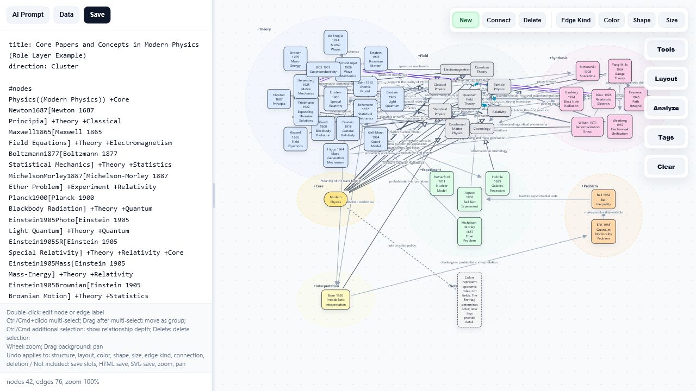
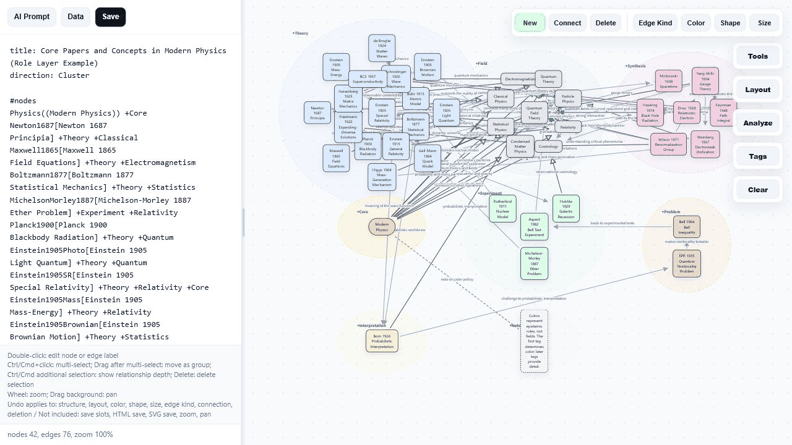
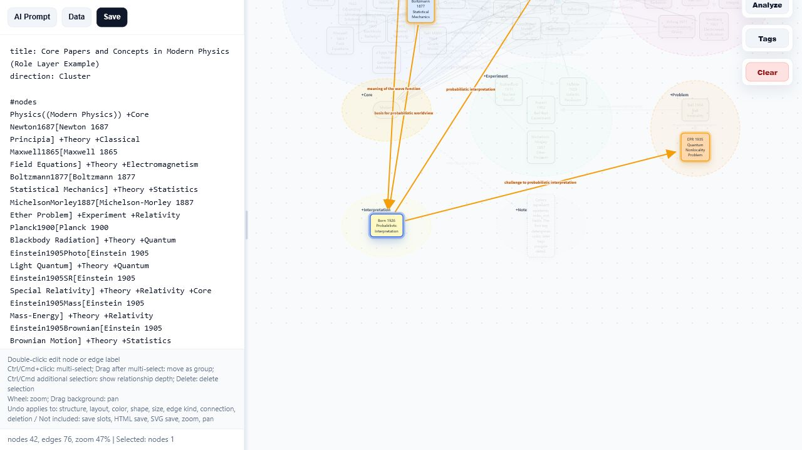
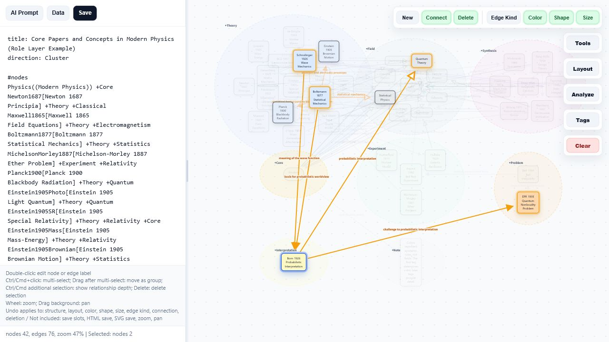

# FlowLite

### Ask AI. Get an interactive relationship map.

FlowLite turns natural language requests into interactive relationship maps.

FlowLite has its own notation, but you do not need to learn it.

Even the author cannot write FlowLite maps by hand.

FlowLite includes its own specification inside the HTML file.  
Attach the HTML file to an AI tool, describe the relationship map you want, and ask the AI to write it in FlowLite format.

The AI follows the specification and generates a structure that FlowLite can render as an interactive map.

---

## Try FlowLite

Let’s try it.

Open FlowLite, ask AI to create a relationship map in FlowLite format, and move the map around.

It is more fun than reading the spec.

[Launch FlowLite](https://rascal-labs.github.io/FlowLite/FlowLite.html)

---

## Use FlowLite with AI

This is the main workflow.

1. Open FlowLite in your browser.
2. Attach the FlowLite HTML file to an AI tool.
3. Describe the relationship map you want in natural language.
4. Ask the AI to create it in FlowLite format.
5. Open the generated structure in FlowLite.
6. Move, edit, connect, tag, analyze, recolor, and reorganize the map visually.
7. Save the result as HTML or SVG.

You can ask for maps like:

- a Zeus-centered Greek mythology map grouped by generation, with tags and colors
- a physics paper influence map showing how major papers affected later theories
- a Dragon Ball character relationship map
- a FizzBuzz program flowchart
- a Codex / Claude Code project relationship map
- a project structure map
- a software architecture map
- a research topic map

FlowLite is not about manually writing diagrams.

It is about giving AI a stable structure format, then using the browser as an interactive relationship-map editor.

---

## Screenshot / Demo


### Main screen



### Click highlight demo




### Relationship highlighting

Click a node to focus on it and highlight its nearby relationships.



Ctrl/Cmd-click another node to compare multiple selected nodes and expand the visible relationship context.



Recommended demo:

1. Attach the FlowLite HTML file to AI.
2. Ask: "Create a Dragon Ball relationship map in FlowLite format."
3. Show the generated relationship map in FlowLite.
4. Click a node to highlight nearby relationships.
5. Ctrl/Cmd-click another node to compare relationship context.
6. Move a node.
7. Edit an edge.
8. Change a tag or color.
9. Switch layout.
10. Use an analysis view to trace relationships.

---

## Example AI Prompts

### Dragon Ball character map

```txt
Create a FlowLite relationship map of Dragon Ball characters.

Include:
- main characters
- families
- rivals
- masters and students
- transformations
- major conflicts

Use tags and colors for:
- Saiyan
- Earthling
- Namekian
- Villain
- Family
- Transformation

Please output the result in FlowLite format.
```

### Zeus-centered mythology map

```txt
Create a FlowLite relationship map centered on Zeus.

Group the characters by generation using tags and colors:
- parent generation
- siblings
- children

Show family relationships, marriages, children, conflicts, and major mythological events.

Please output the result in FlowLite format.
```

### Physics paper influence map

```txt
Create a FlowLite relationship map of major physics papers.

Show how important papers influenced later theories, experiments, and concepts.

Use tags such as:
- Theory
- Experiment
- Interpretation
- Integration
- Problem
- Field

Make it possible to trace how one paper influenced later developments.

Please output the result in FlowLite format.
```

### FizzBuzz program flowchart

```txt
Create a FlowLite flowchart for FizzBuzz.

Show:
- start
- input n
- loop from 1 to n
- check whether i is divisible by 15
- check whether i is divisible by 3
- check whether i is divisible by 5
- output FizzBuzz
- output Fizz
- output Buzz
- output the number
- move to the next i
- end

Use decision nodes for conditions and flow edges for execution order.

Please output the result in FlowLite format.
```

### Codex / Claude Code project map

```txt
Create a FlowLite relationship map for the files under the following folder:

<project-folder-path>

Analyze the files under this folder and show how the instruction files, project files, task files, rule files, memory files, plan files, test files, changelog files, decision files, and FlowLite files relate to each other.

The goal is to make the internal structure of a Codex / Claude Code style project understandable as an interactive relationship map.

Please output the result in FlowLite format.
```

---

## GUI Editing Tips

After AI creates the map, FlowLite becomes a visual editor.

### Basic editing

- double-click a node to edit its text
- double-click an edge label to edit the relationship
- click the new-node button to add a shape
- select nodes and connect them
- change edge type from the line-type menu
- drag nodes to reorganize the map
- Ctrl / Cmd + click to select multiple nodes
- drag selected nodes together to move a group
- use Delete to remove the selected node or edge

### Layout and view control

- switch layout modes to view the same structure differently
- use Flow for process diagrams
- use Cluster for concept maps
- use Lane for tag-based grouping
- use Compact for dense maps
- use Focus for center-oriented maps
- use the mouse wheel to zoom
- drag the background to pan

### Tags and styling

- use tags to group related nodes
- use tag colors to show categories
- change node colors, shapes, and sizes
- use visual differences to separate roles, states, layers, or priorities

### Analysis and exploration

- trace how one node influences another
- inspect related nodes
- identify central nodes
- find bridge-like nodes between groups
- view local neighborhoods around selected nodes
- compare different structural views of the same map

AI creates the first structure.  
You correct, move, simplify, analyze, and reorganize it visually.

---

## What FlowLite Is For

FlowLite helps explain any subject where relationships matter.

Examples:

- character relationship maps
- mythology maps
- research maps
- paper influence maps
- software architecture
- program flowcharts
- Codex / Claude Code project maps
- documentation structure maps
- AI agent instruction maps
- decision maps
- learning maps
- knowledge maps

FlowLite is useful when a linear explanation is not enough and the structure itself needs to be seen.

---

## Core Concept

FlowLite describes the world through three elements:

```txt
Objects
Relationships
Attributes
```

### Objects

Things that exist in the map.

Examples:

- people
- concepts
- papers
- files
- tasks
- modules
- events
- states
- rules
- decisions

### Relationships

Connections between objects.

Examples:

- A influences B
- A belongs to B
- A depends on B
- A blocks B
- A is equivalent to B
- A interacts with B

### Attributes

Additional information attached to objects.

Examples:

- role
- generation
- faction
- state
- priority
- field
- layer
- responsibility
- color group

FlowLite is not just a diagram format.

It is a way to describe objects, relationships, and attributes in plain text that AI can understand and humans can edit visually.

---

## Relationship Types

FlowLite supports several semantic relationship types.

```txt
A -> B   action / flow / influence / reference
A => B   belongs to / category / part of
A == B   same / equivalent / alias
A -- B   related / unspecified association
A <-> B  mutual interaction
A -x-> B blocks / prevents / rejects
```

These relationship types help AI describe more than simple arrows.

---

## Tags and Colors

Tags help organize large maps.

```txt
#nodes
Einstein1905SR[Einstein 1905 Special Relativity] +Theory +Relativity
Minkowski1908[Minkowski 1908 Spacetime] +Integration +Relativity

#styles
+Theory color:#dbeafe
+Integration color:#fbcfe8
```

Tags can represent categories such as:

- role
- generation
- faction
- state
- priority
- field
- layer
- responsibility

---

## Layout Modes

FlowLite can show the same relationship data in different layouts.

```txt
direction: Flow
direction: Cluster
direction: Lane
direction: Compact
direction: Focus
direction: Circle
direction: Grid
direction: Horizontal
direction: Vertical
```

Recommended use:

- `Flow` for processes
- `Cluster` for concept maps
- `Lane` for tag-based grouping
- `Compact` for dense maps
- `Focus` for center-oriented maps

---

## Built-in Examples

The current version includes sample maps such as:

- physics concept map
- Greek mythology relationship map
- FizzBuzz process map

These examples show different ways to use FlowLite:

- concept mapping
- family and character relationships
- process flow
- tag-based coloring
- semantic edge types
- layout switching
- relationship exploration

---

## Current Status

FlowLite v1.00

- single-file HTML app
- no installation required
- built-in FlowLite specification
- AI-friendly structure format
- interactive editing
- semantic relationship types
- tag-based coloring
- multiple layout modes
- analysis views
- HTML / SVG export

---

## Future Vision

FlowLite is a custom notation for building relationship maps from objects, relationships, and attributes.

It is plain text that AI can understand.

Because it is also interactive, humans can control the structure visually through the GUI, and those edits can be reflected back into the plain-text structure.

This opens a path beyond simple diagram generation.

FlowLite can move in three directions:

1. explaining the internal structure of AI-assisted tools
2. controlling projects through interactive relationship maps
3. moving from scattered Markdown files to a FlowLite-centered project structure

### Step 1: Explain the internal structure of AI-assisted tools

Many AI coding tools depend on Markdown files such as:

- AGENTS.md
- CLAUDE.md
- MISSION.md
- TASKS.md
- RULES.md
- MEMORY.md
- TESTING.md
- DECISIONS.md

These files often contain important instructions, rules, memories, plans, and decisions.

But their relationships are not always visible.

If you attach the FlowLite HTML file to an AI tool and ask it to output the relationships of files under a folder in FlowLite format, the AI can turn those hidden relationships into an interactive map.

Example request:

```txt
Create a FlowLite relationship map for the files under the following folder:

<project-folder-path>

Analyze the files under this folder and show how the instruction files, project files, task files, rule files, memory files, plan files, test files, changelog files, decision files, and FlowLite files relate to each other.

Please output the result in FlowLite format.
```

This makes it possible to understand a Codex / Claude Code style project not as a pile of Markdown files, but as a visible structure.

### Step 2: Control the project through an interactive relationship map

Once the relationships are visible, the map can become an editing surface.

You could add:

- new instructions
- new rules
- new forbidden actions
- new task groups
- new memory nodes
- new decision records
- new testing requirements
- new relationships between existing project files

The structure would not only explain the project.

It could help control the project.

A human can inspect the map visually, move nodes, add boxes, connect ideas, and reorganize the project structure.

An AI tool can then read the updated FlowLite structure and understand the new instructions, constraints, priorities, and relationships.

### Step 3: Move from Markdown to FlowLite

If FlowLite can describe objects, relationships, and attributes clearly enough, then some Markdown files may no longer need to exist as separate documents.

A project could keep only minimal entry files such as:

- AGENTS.md
- CLAUDE.md

These files could tell the AI:

```txt
Read project.flowlite first.
The project structure, rules, tasks, memory, decisions, and relationships are defined there.
```

Then `project.flowlite` becomes the central structure file.

Instead of spreading knowledge across many Markdown files, the project can keep its logic in one interactive relationship map.

This could make the project easier for both humans and AI to understand.

Humans can open the HTML and inspect the structure visually.

AI tools can read the FlowLite text and understand the project relationships directly.

The next time an AI agent works on the project, it can start from the same structural map.

That is the larger possibility of FlowLite:

```txt
Not only diagrams from text.
Not only Markdown visualization.
But an interactive structural memory format for AI-assisted projects.
```

FlowLite_Agent is currently under development as an experimental direction toward this idea.

It explores how an AI-assisted project can use a FlowLite map as a structural layer for instructions, rules, tasks, memory, decisions, and relationships.

---

## License

MIT License

---

## Origin

FlowLite was built on a 0.001 BTC machine.

Aren’t you curious what happens at 0.002 BTC?

### Support

If FlowLite made your life even a little easier, you can support the project with Bitcoin.

**On-chain**

```txt
bc1qnutvcr407pzjdpg7fd48h903k65dv2xcvhl23r
```

**Lightning**

```txt
tenbutcher39@walletofsatoshi.com
```
